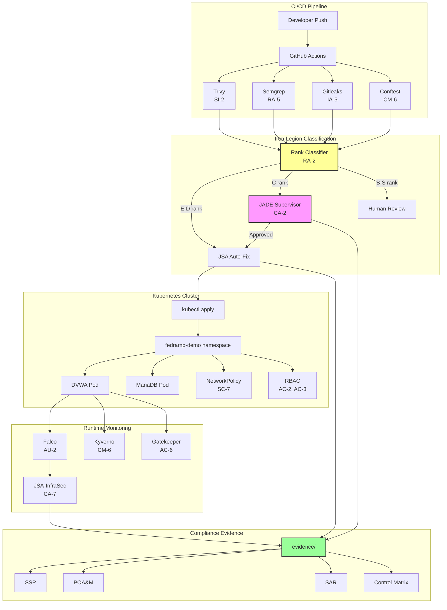
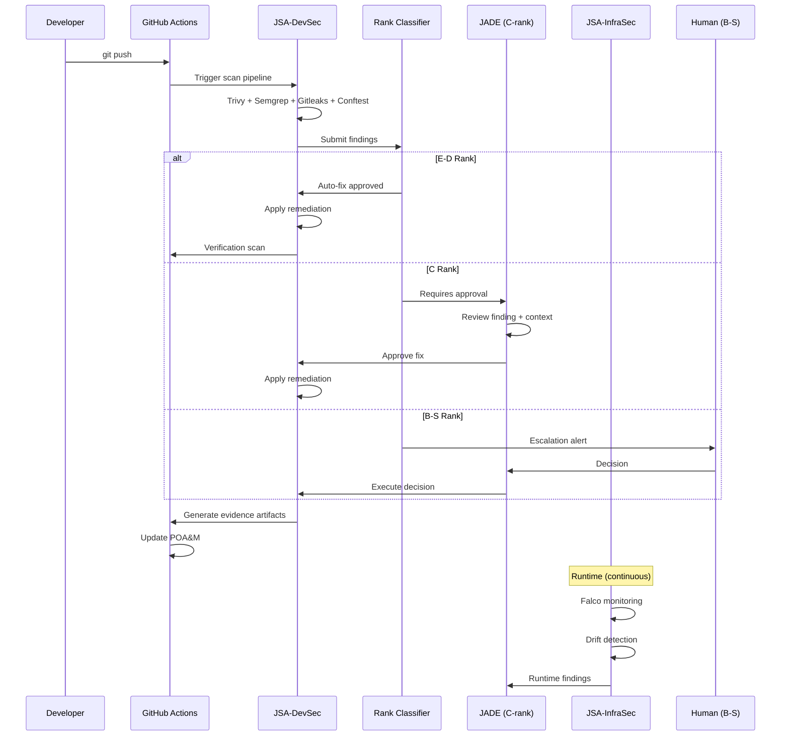
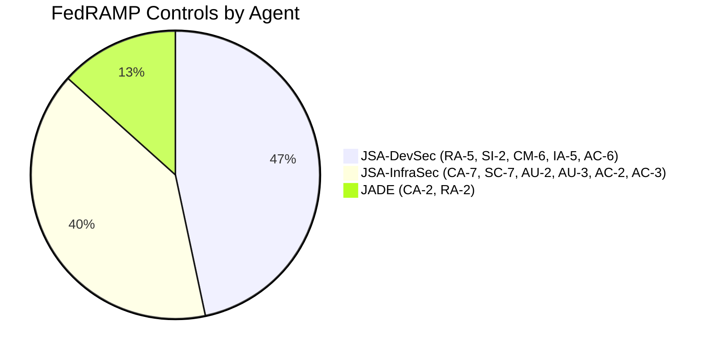

# Iron Legion → FedRAMP Architecture

## System Architecture

```mermaid
graph TB
    subgraph "CI/CD Pipeline"
        DEV[Developer Push] --> GHA[GitHub Actions]
        GHA --> TRIVY[Trivy<br/>SI-2]
        GHA --> SEMGREP[Semgrep<br/>RA-5]
        GHA --> GITLEAKS[Gitleaks<br/>IA-5]
        GHA --> CONFTEST[Conftest<br/>CM-6]
    end

    subgraph "Iron Legion Classification"
        TRIVY --> RANK[Rank Classifier<br/>RA-2]
        SEMGREP --> RANK
        GITLEAKS --> RANK
        CONFTEST --> RANK
        RANK --> |E-D rank| AUTO[JSA Auto-Fix]
        RANK --> |C rank| JADE[JADE Supervisor<br/>CA-2]
        RANK --> |B-S rank| HUMAN[Human Review]
        JADE --> |Approved| AUTO
    end

    subgraph "Kubernetes Cluster"
        AUTO --> DEPLOY[kubectl apply]
        DEPLOY --> NS[fedramp-demo namespace]
        NS --> DVWA[DVWA Pod]
        NS --> DB[MariaDB Pod]
        NS --> NP[NetworkPolicy<br/>SC-7]
        NS --> RBAC[RBAC<br/>AC-2, AC-3]
    end

    subgraph "Runtime Monitoring"
        DVWA --> FALCO[Falco<br/>AU-2]
        DVWA --> KYVERNO[Kyverno<br/>CM-6]
        DVWA --> GKEEPER[Gatekeeper<br/>AC-6]
        FALCO --> INFRASEC[JSA-InfraSec<br/>CA-7]
    end

    subgraph "Compliance Evidence"
        AUTO --> EVIDENCE[evidence/]
        JADE --> EVIDENCE
        INFRASEC --> EVIDENCE
        EVIDENCE --> SSP[SSP]
        EVIDENCE --> POAM[POA&M]
        EVIDENCE --> SAR[SAR]
        EVIDENCE --> MATRIX[Control Matrix]
    end

    style JADE fill:#f9f,stroke:#333,stroke-width:2px
    style RANK fill:#ff9,stroke:#333,stroke-width:2px
    style EVIDENCE fill:#9f9,stroke:#333,stroke-width:2px
```

## Agent Responsibility Flow

```mermaid
sequenceDiagram
    participant Dev as Developer
    participant GHA as GitHub Actions
    participant DevSec as JSA-DevSec
    participant Rank as Rank Classifier
    participant JADE as JADE (C-rank)
    participant InfraSec as JSA-InfraSec
    participant Human as Human (B-S)

    Dev->>GHA: git push
    GHA->>DevSec: Trigger scan pipeline
    DevSec->>DevSec: Trivy + Semgrep + Gitleaks + Conftest
    DevSec->>Rank: Submit findings

    alt E-D Rank
        Rank->>DevSec: Auto-fix approved
        DevSec->>DevSec: Apply remediation
        DevSec->>GHA: Verification scan
    else C Rank
        Rank->>JADE: Requires approval
        JADE->>JADE: Review finding + context
        JADE->>DevSec: Approve fix
        DevSec->>DevSec: Apply remediation
    else B-S Rank
        Rank->>Human: Escalation alert
        Human->>JADE: Decision
        JADE->>DevSec: Execute decision
    end

    DevSec->>GHA: Generate evidence artifacts
    GHA->>GHA: Update POA&M

    Note over InfraSec: Runtime (continuous)
    InfraSec->>InfraSec: Falco monitoring
    InfraSec->>InfraSec: Drift detection
    InfraSec->>JADE: Runtime findings
```

## NIST 800-53 Control Coverage

```mermaid
pie title FedRAMP Controls by Agent
    "JSA-DevSec (RA-5, SI-2, CM-6, IA-5, AC-6)" : 7
    "JSA-InfraSec (CA-7, SC-7, AU-2, AU-3, AC-2, AC-3)" : 6
    "JADE (CA-2, RA-2)" : 2
```
